# TransferBuddy screenshots — 0.2.14

These images come from the actual egui and ratatui renderers. Devices, files and
upgrade progress are demonstration fixtures; no switch is contacted to create
them. The desktop preview pins a local interface for the fixture devices' copy
addresses. Desktop images show the default Compact density at 0.85 scale unless
stated otherwise. All captions and version labels reflect this release.

## Desktop

### Dashboard

Service controls, transfer status and interface selection.


### Connect

Shared SSH connections with facts, reconnect and CLI actions.

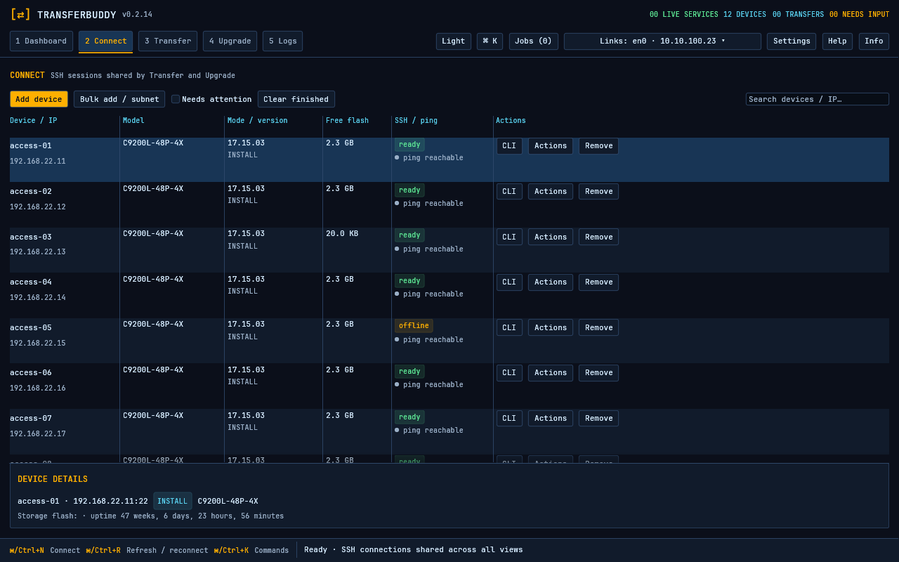

### Transfer

Local/remote browsing and explicit source/destination copy actions.

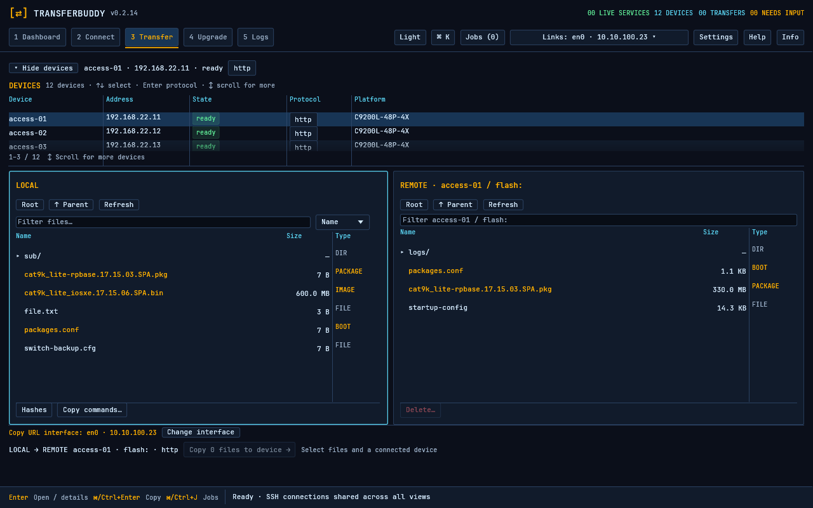

### Upgrade

Image selection, per-device assignments, current → target release and MD5 gates.

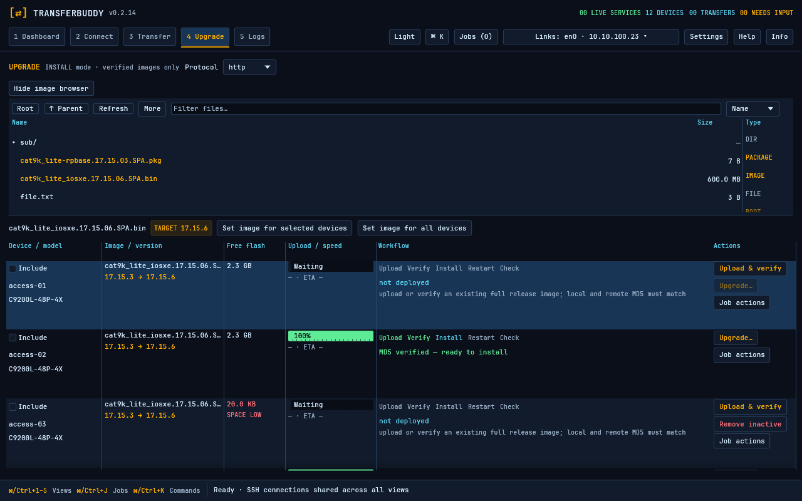

### Logs

Device/protocol context and the actual copy command.

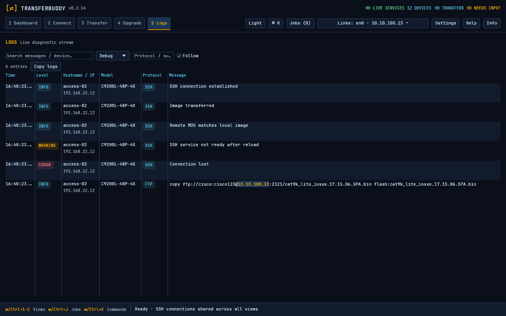

### Global interface selector

Copy URL address and per-protocol service bind overrides, available from every view.


### CLI windows

Independent black consoles with minimize/close and a bottom taskbar.

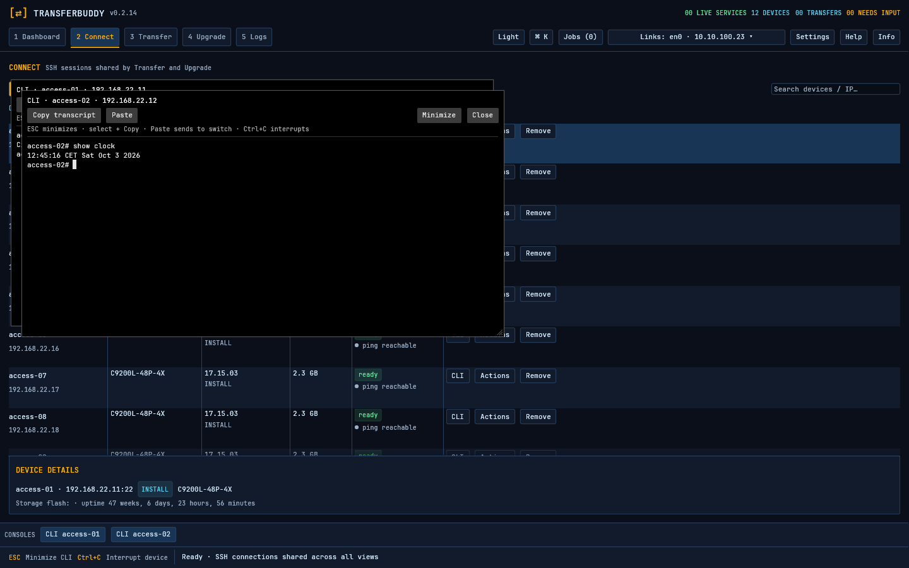

### Guided workflow

Device/file selection, preflight and reviewed actions.

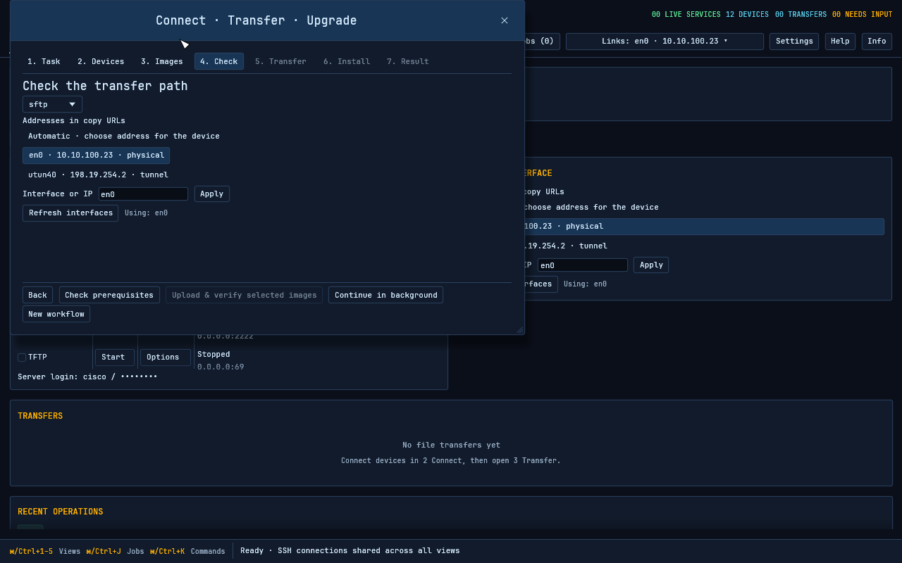

### Queue and retry

Progress, pause/failure context and explicit recovery. This queue image uses
Standard density at 1.0 scale to show the wider layout.

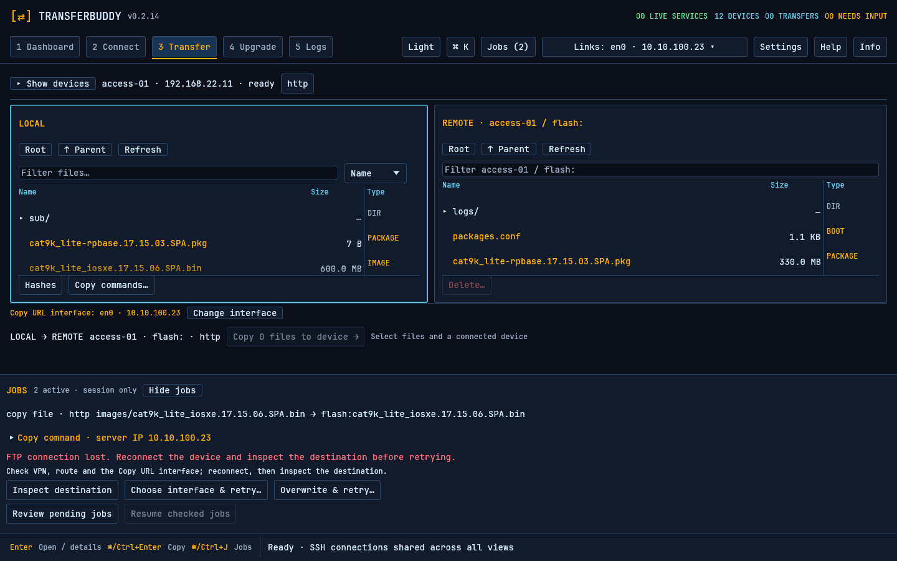

### Settings and light appearance

Scale/density preferences, automatic host-key acceptance and theme controls.

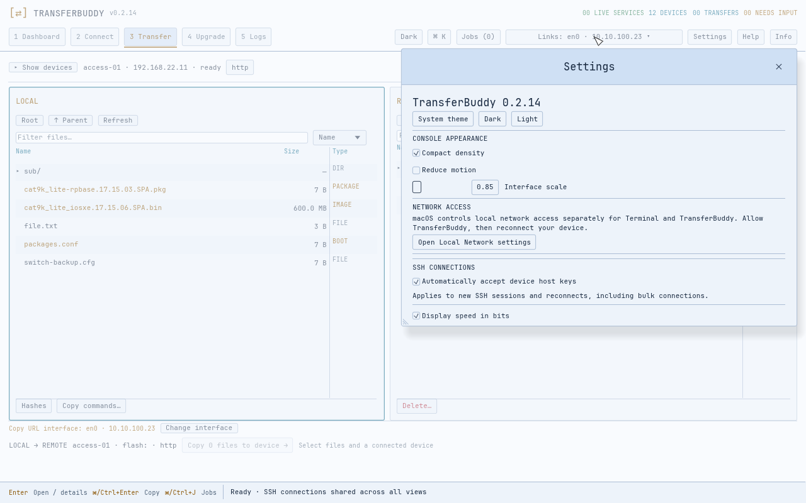

The following overview uses light appearance with Standard density at 1.0 scale.

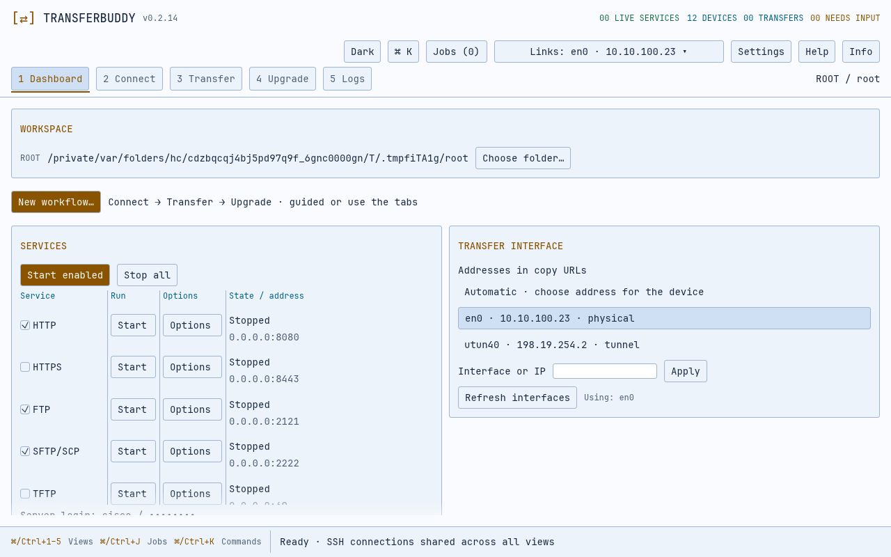

## Terminal UI

The same five workspaces in a keyboard-driven terminal.


### Intro and help


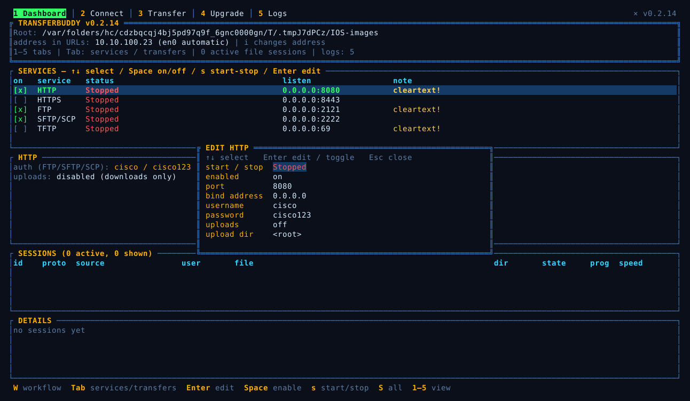
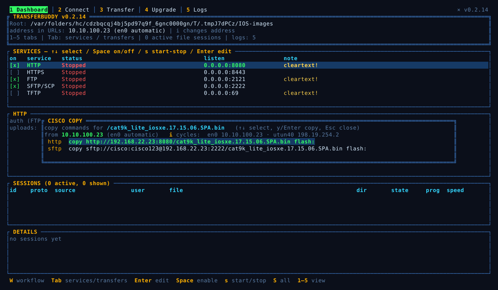

## Regenerate

Run from the repository root. GUI rendering needs a graphics adapter:

```bash
cargo test --locked -p transferbuddy-desktop desktop_preview -- --ignored --nocapture
cargo test --locked -p transferbuddy documentation_screenshots -- --ignored --nocapture
python3 scripts/update-screenshots.py
```

GUI review images are first generated under ignored `dist/gui-review`. The copy
script selects the documented views, checks that every input exists, and updates
the tracked desktop gallery. TUI SVGs are exported directly from styled terminal
buffers into `tui/`. Review the rendered images before publishing them.
